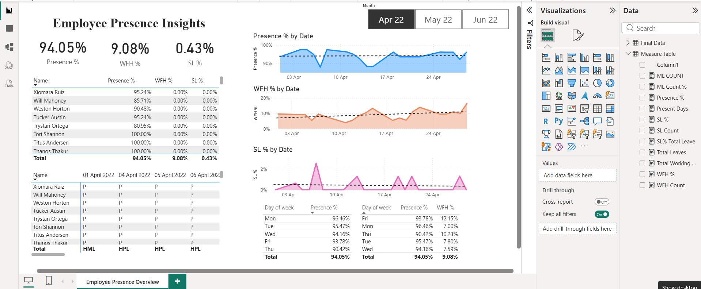
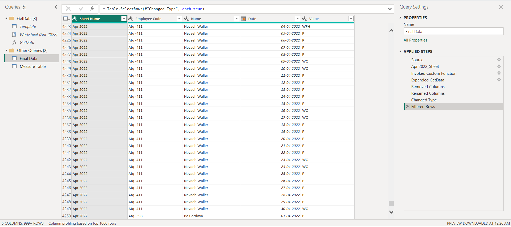
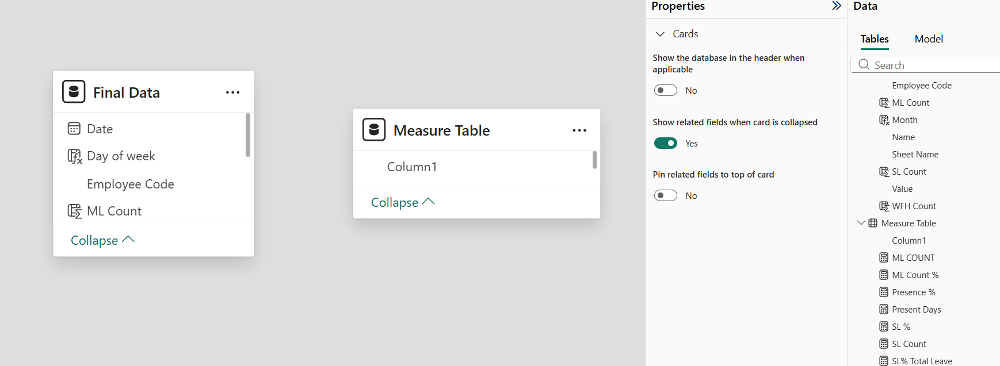
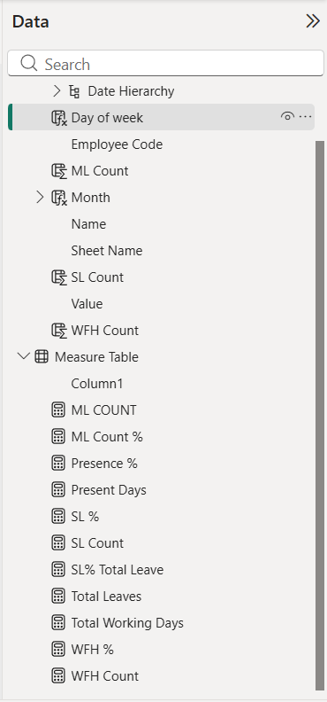

# 👨‍💼 Employee Presence HR Data Analysis

<div align="center">


### Transforming Employee Attendance Data into Actionable Workforce Insights

Interactive HR Analytics Dashboard built using **Power BI**, **Power Query**, and **DAX** to analyze employee attendance, work-from-home trends, sick leave patterns, and workforce presence metrics.

<p align="center">
  <a href="https://github.com/KuhuVyas/Employee-Presence-HR-Data-Analysis">
    
  </a>
</p>

</div>

---

# 📌 Project Overview

Organizations operating in a hybrid work environment require visibility into employee attendance patterns to optimize workforce planning, office infrastructure, and employee well-being.

This project analyzes employee presence data across three months and provides an interactive Power BI dashboard that enables HR teams to monitor attendance behavior, identify work-from-home preferences, and detect potential absenteeism trends.

---

# 🎯 Business Problem

The HR department relied on manual Excel-based attendance tracking, making it difficult to:

* Monitor workforce attendance efficiently
* Analyze Work From Home (WFH) adoption trends
* Track employee sick leave behavior
* Optimize office space utilization
* Plan organizational events based on attendance patterns
* Make proactive workforce management decisions

The goal was to develop a centralized analytics solution capable of converting raw attendance logs into actionable business insights.

---

# 📊 Dashboard Preview

## Employee Presence Dashboard



## Data Transformation Workflow


## Data Model


## DAX Measures



---

# 🚀 Key Metrics

| Metric             | Value                  |
| ------------------ | ---------------------- |
| Analysis Period    | 3 Months               |
| Date Range         | April 2022 – June 2022 |
| Attendance Records | 6,492                  |
| Employees Tracked  | 78–84                  |
| DAX Measures       | 11                     |
| Calculated Columns | 5                      |
| Data Model         | Flat Table Schema      |
| Dashboard Pages    | 1 Interactive Report   |

---

# 🗂 Dataset Information

### Source

Real-world employee attendance dataset from a software and data solutions company.

To preserve confidentiality, employee names and identifiers were anonymized.

### Monthly Employee Count

| Month      | Employees |
| ---------- | --------- |
| April 2022 | 78        |
| May 2022   | 84        |
| June 2022  | 83        |

### Attendance Categories

```text
P      - Present
WFH    - Work From Home
HWFH   - Half Work From Home
SL     - Sick Leave
HSL    - Half Sick Leave
PL     - Paid Leave
HPL    - Half Paid Leave
ML     - Menstrual Leave
HML    - Half Menstrual Leave
LWP    - Leave Without Pay
HLWP   - Half Leave Without Pay
BL     - Bereavement Leave
BRL    - Birthday Leave
FFL    - Flexible Festival Leave
WO     - Weekly Off
HO     - Holiday Off
```

---

# 🔄 Power Query Transformation Workflow

The raw attendance data was initially stored in separate monthly Excel sheets in a wide-table format.

## Data Cleaning

* Removed unnecessary top rows
* Promoted headers
* Corrected data types
* Removed invalid date conversion errors
* Standardized attendance values

## Data Transformation

* Created reusable Power Query function
* Applied transformations dynamically across all monthly sheets
* Appended April, May, and June data
* Converted wide-format attendance sheets into a tabular structure

## Unpivoting Process

### Before

| Employee   | 1 Apr | 2 Apr | 3 Apr |
| ---------- | ----- | ----- | ----- |
| Employee A | P     | WFH   | P     |

### After

| Employee   | Date  | Attendance |
| ---------- | ----- | ---------- |
| Employee A | 1 Apr | P          |
| Employee A | 2 Apr | WFH        |
| Employee A | 3 Apr | P          |

This transformation enabled dynamic time-based analytics and trend analysis.

---

# 🏗 Data Model

The project uses a simplified **Flat Table Schema**.

### Tables Used

#### Final Data

Primary attendance fact table containing:

* Employee Code
* Employee Name
* Date
* Attendance Status
* Day of Week
* Month
* Attendance Metrics

#### Measure Table

Dedicated table used to organize DAX measures.

---

# 🧮 Calculated Columns

| Column      | Purpose                                 |
| ----------- | --------------------------------------- |
| WFH Count   | Converts WFH/HWFH into numerical values |
| SL Count    | Converts SL/HSL into numerical values   |
| ML Count    | Converts ML/HML into numerical values   |
| Month       | Creates month slicer values             |
| Day of Week | Enables weekday trend analysis          |

---

# 📐 DAX Measures

The dashboard contains **11 custom DAX measures**.

| Measure            |
| ------------------ |
| Total Working Days |
| Present Days       |
| Presence %         |
| WFH Count          |
| WFH %              |
| SL Count           |
| SL %               |
| Total Leaves       |
| SL% Total Leave    |
| ML Count           |
| ML Count %         |

### Sample DAX Logic

#### Presence %

```DAX
Presence % =
DIVIDE(
    [Present Days],
    [Total Working Days],
    0
)
```

#### Present Days

```DAX
Present Days =
VAR PresentDays =
CALCULATE(
    COUNT('Final Data'[Value]),
    'Final Data'[Value] = "P"
)

RETURN
PresentDays + [WFH Count]
```

---

# 📈 Dashboard Features

### KPI Monitoring

* Presence Percentage
* Work From Home Percentage
* Sick Leave Percentage

### Attendance Trends

* Daily Presence Trend
* Daily WFH Trend
* Daily Sick Leave Trend

### Employee-Level Analysis

* Individual Attendance Performance
* Employee WFH Utilization
* Employee Sick Leave Monitoring

### Workforce Analytics

* Day-wise Attendance Patterns
* Day-wise WFH Preferences
* Day-wise Presence Trends

### Interactive Filtering

* Month-Level Slicer
* Employee-Level Drilldown
* Dynamic Cross Filtering

---

# 🔍 Key Business Insights

## 1. Peak Office Attendance

Employees showed the highest office presence on:

* Monday
* Tuesday

This makes these days ideal for:

* Team meetings
* Town halls
* Training programs
* Team-building activities

---

## 2. Friday WFH Preference

Employees consistently preferred remote work toward the end of the week.

Observed WFH spikes:

**~10–16% on Fridays**

Potential use cases:

* Office maintenance
* Infrastructure upgrades
* Reduced operational costs

---

## 3. Increasing Absenteeism Trend

Compared to April:

* Sick leave increased during May
* Presence percentage decreased
* Remote work usage increased

This pattern may indicate seasonal workforce behavior.

---

## 4. Hybrid Workforce Optimization

Attendance trends suggest that office occupancy rarely reaches maximum capacity.

Potential benefits:

* Reduced office space requirements
* Hot-desking implementation
* Lower infrastructure costs

---

# 💡 Business Impact

The dashboard enables organizations to:

✅ Improve workforce planning

✅ Optimize office infrastructure

✅ Track employee attendance trends

✅ Support hybrid work strategies

✅ Monitor workforce well-being

✅ Enable data-driven HR decision making

---

# 🛠 Technology Stack

| Tool             | Purpose                        |
| ---------------- | ------------------------------ |
| Power BI Desktop | Dashboard Development          |
| Power Query      | Data Cleaning & Transformation |
| DAX              | KPI & Metric Creation          |
| Microsoft Excel  | Source Data Storage            |

---

# 📚 Key Learnings

Through this project I gained practical experience in:

* Building end-to-end Power BI dashboards
* Designing KPI-driven analytics reports
* Writing DAX measures for business metrics
* Performing data transformation using Power Query
* Applying unpivoting techniques for reporting
* Translating business requirements into visual analytics solutions
* Presenting actionable insights to stakeholders

---

# 🔮 Future Enhancements

* Automated attendance threshold alerts
* Power BI Service deployment
* Scheduled data refresh
* Department-level analytics
* Attendance forecasting
* Automated HR email notifications
* Workforce anomaly detection

---

# 📂 Repository Structure

```text
Employee-Presence-HR-Data-Analysis/
│
├── employee_presence_hr_data.pbix
├── README.md
│
├── assets/
│   ├── dashboard-overview.png
│   ├── power-query-flow.png
│   ├── data-model.png
│   └── dax-measures.png
│
└── dataset/
├── raw_data.xlsx
└── cleaned_data.xlsx

```

---

# 👤 Author

### Kuhu Vyas

Aspiring Data Analyst passionate about transforming data into actionable business insights through analytics, visualization, and business intelligence.

🔗 Repository: https://github.com/KuhuVyas/Employee-Presence-HR-Data-Analysis

---
